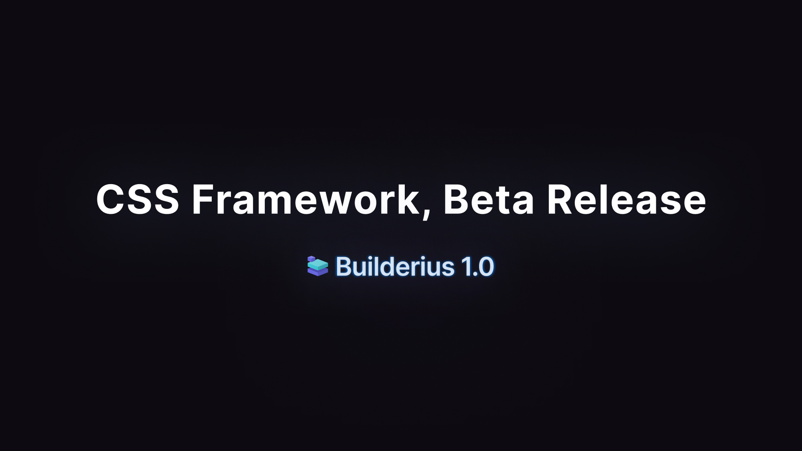

# Builderius CSS - 1.0 Beta
## A Minimal CSS Framework for Builderius Site Builder
A minimalist and lightweight starter CSS that prioritizes semantic HTML, uses CSS Variables and simple utility classes. It takes this minimalist approach to CSS frameworks and adapts them to the specific visual builder environment so that it aligns better with the logic of the UI and helps users get a quick start.

## How does it help users get a quick start?
- Drop any html element into the canvas and it will look nice and be responsive out of the box. 
- It takes care of the basic global styling so that you can extend it to fit your needs faster then building from scratch would take you.

## Video walkthrough

[](https://youtu.be/EwfXgAwvsRo)

## What is included?

### Elegant HTML Reset
- Responsive
- Looks great out of the box
- Lightweight
- Low Specificity for easy overrides
- Semantic styles (button, [input=submit], [role=button] and .button receive the same styles)

### Quick Start Cheatsheet

[Quick explanation of assets available and how to approach them](./css-framework-cheatsheet.md)

### Tokenization and Figma integration
The framework is built around "tokens"—constant values for colors, sizes, and style variations. These tokens are applied consistently throughout the framework, so updating them automatically updates all related CSS variables and classes. This approach ensures a reliable and scalable design system. It also enhances integration with our Figma design file, making the transition from design to development smoother and more efficient.
- Figma basic design file (FREE): *to be revealed soon*
- Figma plugin (FREE): *to be revealed soon*

### Fluid Typography
Framework uses `clamp()` to set flexible sizes for typography that scale with the size of the browser making the typography fit every screen size.

### Modern selectors for managing low specificity
Framework has to be easy to override on local level, without the need to overuse the high specificity selectors like ID based selectors. We use `:where()` frequently for this reason as well as making the selectors grouping more elegant and readable.

### CSS Variables
From tokens-based variables like `--size--1` to a more specific `--border--width` the framework makes it easy to apply consistent changes to as many or as little elements one wants.

#### Colors
Builderius CSS uses a structured, token-based color system for consistency and flexibility. The primary color (--color--primary) generates 12 shades automatically, ranging from light to dark. The base grayscale (--color--base) also consists of 12 steps (25, 50, 100, 200, ..., 950) and is subtly tinted with the primary color. Additional colors can be defined (e.g., --color--secondary or any custom name), each generating its own 12 shades. The shades are generated within the accompanying Figma plugin, ensuring a seamless transition between design and development.

#### Typography
Provides 6 sizes type scale applied to headings automatically or added with classes `.font-size-1` or with variables like `--font--size--1`.

#### Sizes and Spacing
Tokens we use are `--size--0`, `--size--1`, `--size--2` ... and each this variable is equal to 2*x where 'x' is the number in the name. Therefore, `--size--1` equal to '2px, `--size--2` is equal to '4px' and so on.

We use CSS variables `--spacing--sm`, `--spacing--lg` etc to apply spacing to your elements. These are mapped to size related variables mentioned before. Additionally, you might want to use more specific CSS variables like `--spacing--block` and `--spacing--inline`.

#### Borders
We offer variables like `--border--color`, `--border--radius` and `--border--width`.

#### Border radius
Use `--radius--md`, `--radius--lg` ... to apply border radius to your elements. These are mapped to size related variables mentioned before. Add additional ones to the list, or change the values as per your need. 

#### Container widths
Use `--container--width`, for invoking the default maximum width for containers, or specify `--container--min`, `--container--narrow`, `--container--max`, and `--container--full`. We recommend not to give static value to `--container--width` itself, but reference one of the specific ones, by default we declare it like this `--container--width: var(--container--max);`.

#### Grid properties
We include `--grid--item-min-width`, `--grid--item-max-width`, `--grid--gap` and more, use these to maintain consistency over your grids, yet retain flexibility.

### Classes
We include a series of utilities and common use classes to get you started. `.flex-row`, `.flex-column`, `.grid`, `.card` are notable examples. We also include some classes that do the same things some CSS variables do so you can use class or variable as per your preference.

## Recommendations on how to extend the Framework
### Working with the Variables
Our parser in Builderius visual builder plugin captures the names of the variables and uses those names to organize the variables list in the UI. Knowing how this happens can help you organize the variables the way you want. By the way of naming, you can craft your own "Theme Settings" with the variables manager.

### Colors
By default, color 'primary' and shade 500 is used in all styles. There is also a special class `.color-primary` to quickly apply primary to some texts etc. Support for custom color must be added manually, preferably using the similar approach.

### Some principles as you work with the variables
1. First part of the variable name will be the name of the variable group in "CSS vars" tab inside Builderius builder.
2. Figma integration wise: any parts of CSS variable name split by `--` (double dash) will be transformed into Figma variable collection/category when using our Figma plugin for export/import the tokens.
3. It is generally a good idea to group variables by their use-case, rather than the type.
4. We suggest creating "functional" variables, rather than trying to extend "design" ones.
5. It is generally better to redefine the variable in a specific "scope" then to make a new one.
6. `color` group is a special one, and we suggest extending it by using our Figma plugin or manually re-creating the same structure and naming, which are: always adding 12 shades and calling them like `--color--<color_name>--25` etc.

#### Names and grouping 
**If you name your variables like:**

- `--form--button--active`
- `--form--button--disabled`
- `--form--hero--section`
- `--border--hero--section`

They will get grouped under the accordion **Form**, and **Border**

 **If you name your variables like:**

- `--button--color--active`
- `--button--color--disabled`
- `--hero--color--section`
- `--hero--border--section`

They will get grouped under the accordion **Button** and **Hero**, and as a consequence your settings for hero sections will be grouped together, as well as for the buttons.

#### Prefer local overrides
If you need to override the variable value do not make a higher specificity selector, or make a new variable rather redeclare the variable in the local scope.

**Here is an example:**
A global variable will look like this:
```
:root {
--some--variable: 1234;
} 
```

And it can be override like this:
```
.button-primary {
--some--variable: 4321;
}
```

### Working with the Classes
We provide only the basic classes to the framework for now. You can easily add more classes whichever way you will like. Pasting your usual ones inside the code editor. Making them as you go. Making them using the selectors panel.

If you think we should add certain classes out of the box, please recommend them and we will look into it.

## How to give feedback and influence the Builderius framework going forward?

You can use GitHub issues and comments to give us feedback. Alternatively you can send us an email to support@builderius.io or at [Builderius Facebook Community](https://www.facebook.com/groups/builderians).

Thank you for being a part of Builderius development.
